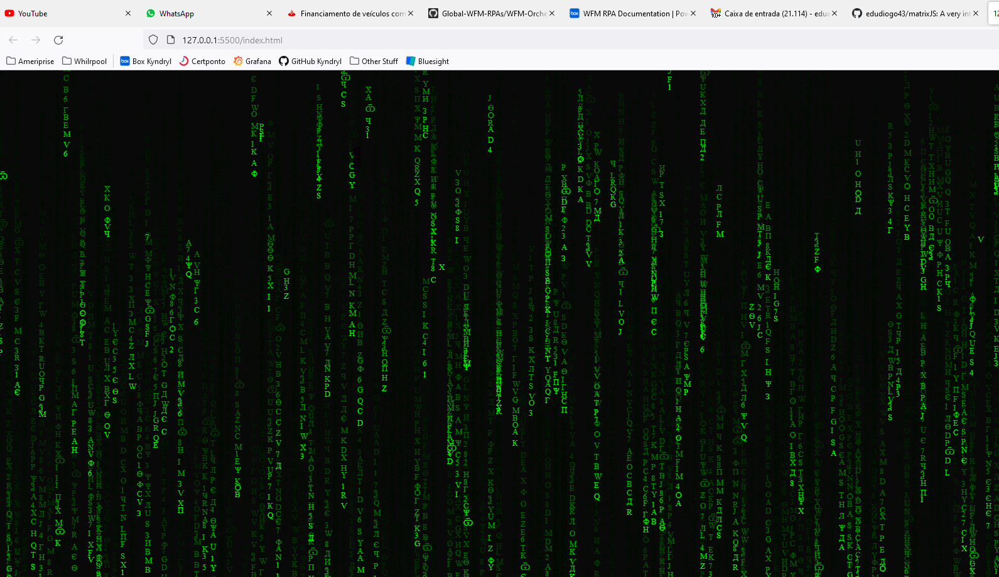

# matrixJS
A very interesting way of creating Matrix effect using javascript

## How to use
Just open the index.html on your browser and the magic will start!

## Matrix happening

## License
MIT License

## Author
Servet Gulnaroglu
https://www.youtube.com/channel/UCvPPXcl5dJiBgRKGTA8inPA
